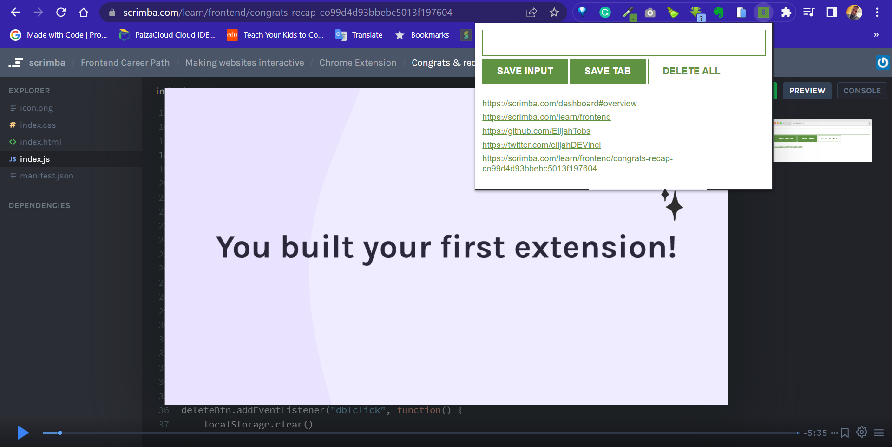

# Leads Tracker Chrome Extension

## Description



> This simple Leads Tracker Chrome Extension is used to generate leads by getting and saving to your local storage the current tab you're on.
It has three buttons.

>>**i. SAVE INPUT :** You can paste or  type in a link to the input field and save it using the *save input* button.

>>**ii. SAVE TAB :** When you click this button, the link of the current tab in the current window is being saved 

>>**iii. DELETE ALL :** This button deletes all the links that has been gathered or saved in the extension.

> This is part of the [**Scrimba Front-End Career Path**](https://scrimba.com/learn/frontend) projects

## Built With

- HTML
- CSS
- JavaScript

## Usage

To get a local copy up and running follow these simple example steps.

1. Download the Zip file on github
``` https://github.com/ElijahTobs/Chrome-Extension ```
2. Extract all files
3. Open ```chrome://extensions/``` in your chrome browser and toggle on the developer mode at the top right corner
4. Click ```Load unpacked``` at the top left corner and select the folder that directly contains the files for this project.
5. Open up any tab and start using the extension 🫶


## Test

For tracking linter errors locally you need to follow these steps:

After cloning the project you need to run these commands

``` npm install ```  
`` This command will download all the dependancies of the project ``

For tracking linter errors in HTML file, run:

``` npx hint index.html ```

For tracking linter errors in CSS or SASS file, run:

``` npx stylelint "\*_/_.{css,scss}" ```

And For tracking linter errors in JavaScript file, run:

``` npx eslint index.js ```

## Live Demo

See the live by clicking [Live Demo Link](https://elijah-score-board.netlify.app/)

## Author

👤 **Elijah Ayandokun**

- GitHub: [@ElijahTobs](https://github.com/ElijahTobs)
- Twitter: [@ElijahTobs](https://twitter.com/elijahDevinci)
- LinkedIn: [Elijah Ayandokun](https://www.linkedin.com/in/elijahayandokun/)

## 🤝 Contributing

Contributions, issues, and feature requests are welcome!

Feel free to check the [issues page](https://github.com/ElijahTobs/Chrome-Extension/issues/).

## Show your support

Give a ⭐️ if you like this project!

## Acknowledgments

- Thanks to everyone who will get time to check this code and sugest any [issue](https://github.com/ElijahTobs/Chrome-Extension/issues) to improve the page.
- Thank you [Scrimba](https://www.scrimba.com/)

## 📝 License

This project is [MIT](./MIT.md) licensed.
